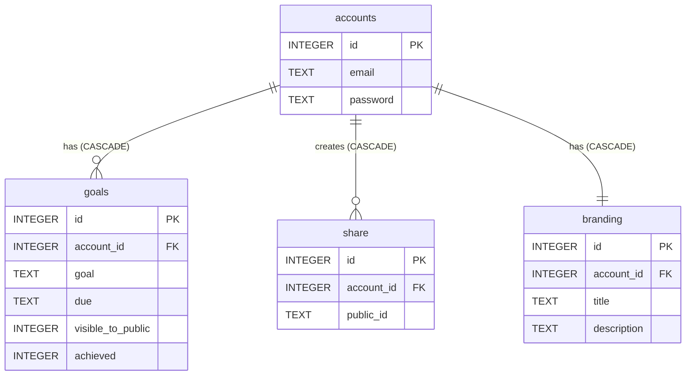

# Wiki

## Use Cases

Users can add, edit and delete there goals. Goals are shown in a timeline view.
The user can share the timeline using a dedicated share link with stakeholders. Stakeholders can view the timeline without any registration. Users can only manage there own goals and timeline.

## System Design

### How many users?

We expect 1.000 Users in total and 100 active users at a time.

### How often do they open the app?

A user will login once a day and will requests the timeline once each hour. The shared timeline will be requests (in average) 10 times per user per second. There can be peaks up to 100 times per user per second.

Simplified formula: 10 ops/second _ 100 users/day = 1000 (ops _ users)/second => SQLite can handle aprox. 1000 isnerts/second.

## Database Design

